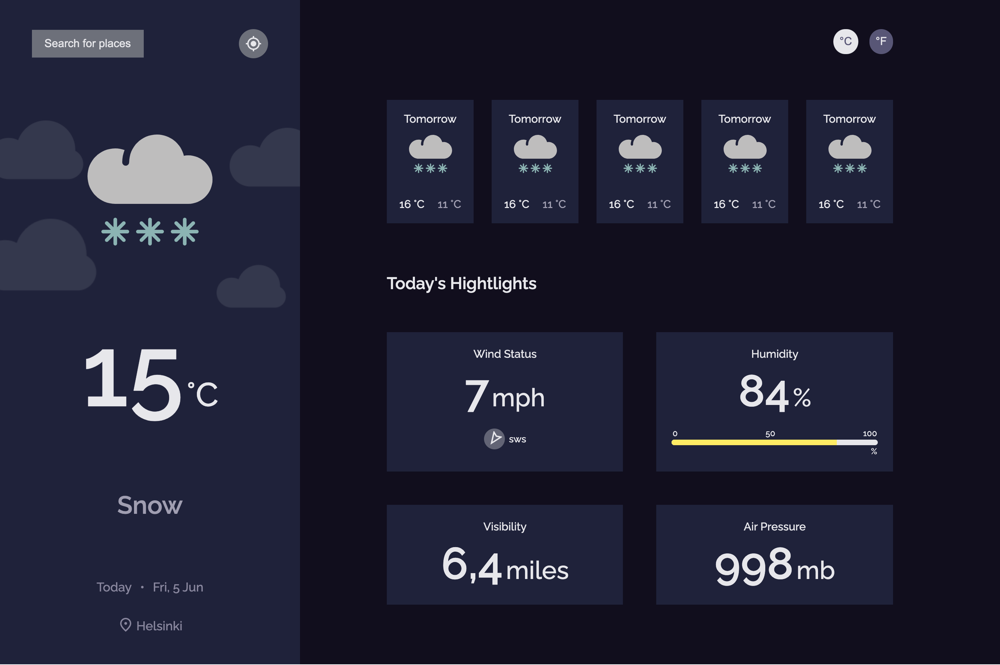

# Weather App - HTML + SASS

This project was a study about different ways to create the same project. This was made using only **HTML** and **SASS**, but you can switch between branches and view the other implementations, using **JavaScript**, **TypeScript** and **Vue 2**

The idea behind this version is to use only **HTML** and **SASS** to create only the layout part of the projetct, in a isolate way.

This version will be the base for the **JavaScript**, **TypeScript**, **Vue 2** and etc.

### Test Environment

https://weather-app-htmlsass.netlify.app/


### The challenge

Create a weather app using an API.

Users should be able to:

- See city weather
- See weather of today and the next 5 days
- Search for city
- Request my current location weather
- Convert temperature in Celcius to Fahrenheit and vice versa
- and more...

**The project ideia is from [DevChallenges](https://devchallenges.io/challenges/mM1UIenRhK808W8qmLWv).**


### Built with

- [SCSS](https://sass-lang.com/)
- [Webpack](https://webpack.js.org/)
  - [HTML Webpack Plugin](https://webpack.js.org/plugins/html-webpack-plugin/)
  - [Mini CSS Extract Plugin](https://webpack.js.org/plugins/mini-css-extract-plugin/)
  - [Style Loader](https://webpack.js.org/loaders/style-loader/)
  - [CSS Loader](https://webpack.js.org/loaders/css-loader/)
  - [SASS Loader](https://www.npmjs.com/package/sass-loader)
  - [Webpack Dev Server](https://webpack.js.org/configuration/dev-server/)

### How to run

To run locally the project you will need the `node` and follow the steps below:

```sh

# Clone the project
git clone git@github.com:ianwelerson/weather-app.git

# Open the folder
cd weather-app

# Install dependencies
npm install

### ---- Prod

# Build for production
npm run prod # The files will be in the /dist/ folder

### ---- Dev

# Build for development
npm run dev # The files will be in the /dist/ folder

# Run dev server
npm run serve

```

### Screen

 

### Author

- Website - [IanWelerson.com](https://ianwelerson.com)
- Twitter - [@IanWelerson](https://www.twitter.com/ianwelerson)